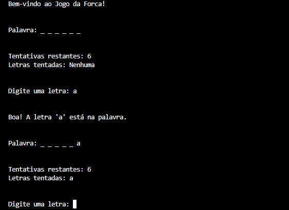

# Jogo-da-Forca-em-Python
Este projeto consiste em um jogo da forca desenvolvida em Python, executado inteiramente no terminal. O programa apresenta um menu de opções, permitindo que o usuário escolha a operação desejada, insira as opções e obtenha o resultado. Além disso, há um menu interativo que exibe informações importantes durante a partida, como letras já jogadas e número de tentativas restantes.

<p align = "left">

</p>

## Demonstração



Interface do jogo da forca em execução no terminal.

## Instalação e Pré-requisitos

### Pré-requisitos

- Python 3.8 ou superior instalado no sistema;
- Terminal ou prompt de comando para executar o programa;
- Sistema operacional Windows, Linux ou macOS.

### Passos para Instalar

1. Baixe ou clone o projeto;
2. Verifique se você possui Python 3 instalado no computador.

## Usos e Exemplos

Após baixar ou clonar o projeto, siga os passos abaixo para executar o jogo no terminal.

### Executando o Jogo:

No Windows:

```
python main.py
```

No Linux/macOS:

```
python3 main.py
```

## Como Utilizar

1. Uma palavra secreta será escolhida automaticamente;
2. O jogo exibirá a palavra oculta, representada por traços (`_`), indicando a quantidade de letras;
3. Digite uma letra no terminal para fazer uma tentativa;
4. O jogo informará se a letra digitada está correta ou não e atualizará a palavra.

## Estrutura do Projeto

```
Jogo-da-Forca-em-Python/
├── assets/
│   └── Jogo-da-Forca-Terminal.png
├── LICENSE
├── README.md
├── main.py 
└── words.txt
```

## Licença 

Este projeto está licenciado sob a MIT License - veja o arquivo [LICENSE](LICENSE) para mais detalhes. 
